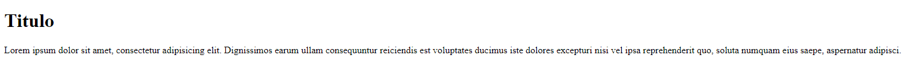
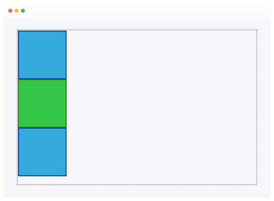
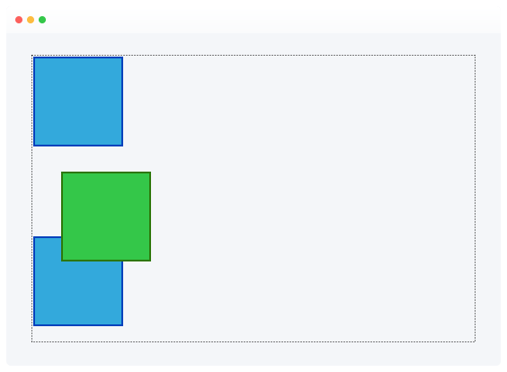
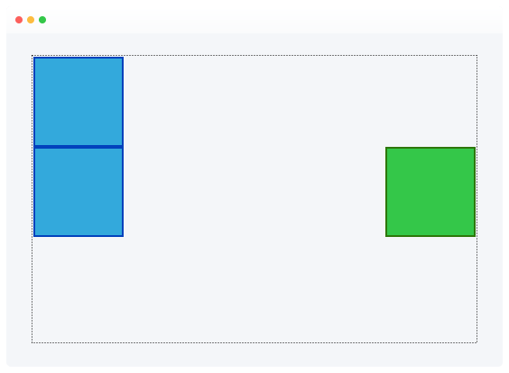
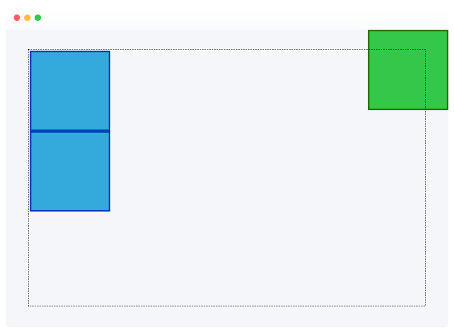

# Aprendiendo HTML y CSS

- [Aprendiendo HTML y CSS](#aprendiendo-html-y-css)
  - [HTML (HyperText Markup Language)](#html-hypertext-markup-language)
    - [Estructura HTML](#estructura-html)
    - [Algunos Tags Comunes](#algunos-tags-comunes)
    - [Ejemplo](#ejemplo)
      - [Preview](#preview)
  - [CSS (Cascading Style Sheets)](#css-cascading-style-sheets)
    - [Estructura CSS](#estructura-css)
    - [Especificidad](#especificidad)
      - [Prioridad](#prioridad)
      - [Como Calcular la Especificidad](#como-calcular-la-especificidad)
    - [Metodologia BEM](#metodologia-bem)
      - [HTML](#html)
      - [CSS](#css)
    - [Unidades](#unidades)
    - [Padding](#padding)
    - [Posicion](#posicion)
    - [Display](#display)
    - [Overflow](#overflow)
    - [Pseudo-elementos](#pseudo-elementos)
    - [Pseudo-clases](#pseudo-clases)
    - [Cursor](#cursor)
    - [CSS @media Rule](#css-media-rule)
    - [Flexbox](#flexbox)

## HTML (HyperText Markup Language)

Es un estándar que sirve de referencia del software que conecta con la elaboración de páginas web en sus diferentes versiones, define una estructura básica y un código (denominado código HTML) para la definición de contenido de una página web, como texto, imágenes, videos, juegos, entre otros.

### Estructura HTML

```html
<!-- Empieza y finaliza con el tag "html" -->
<html>
  <!-- El siguiente tag es "head" -->
  <head>
    <!-- "head" incluye el tag "tittle" -->
    <title> </title>
  </head>
  <!-- El tag "body" es donde se encuentra la parte visible de la web -->
  <body></body>
</html>
```

### Algunos Tags Comunes

| Tag                         | Descripción                   |
| :-------------------------- | :---------------------------- |
| `&nbsp;`                    | Espacio en blanco             |
| `<!-- --- >`                | Comentarios                   |
| `<html></html>`             | Inicio de Todo Documento HTML |
| `<head></head>`             | Cabecera del Documento HTML   |
| `<meta name= >`             | Metadatos                     |
| `<title></title>`           | Titulo del Documento          |
| `<body></body>`             | Cuerpo del HTML               |
| `<a href="index.html"></a>` | Creacion de Enlaces           |
| ``       | Etiqueta de Imagen            |
| `<b></b>`                   | Negrita                       |
| `<i></i>`                   | Curvisa                       |
| `<u></u>`                   | Subrayado                     |
| `<blockquote></blockquote>` | Separa Texto                  |
| `<br>`                      | Salto de Linea                |
| `<button></button>`         | Añade un Boton                |
| `<caption></caption>`       | Titulo de Tabla               |
| `<div></div>`               | Contenedor Generico de Bloque |
| `<h1></h1>`                 | Heading 1 al 6                |
| `<p></p>`                   | Parrafo                       |
| `<ul></ul>`                 | Lista sin Orden               |
| `<ol></ol>`                 | Lista con Orden               |
| `<li></li>`                 | Elemento de la Lista          |
|                             |                               |

Más [ejemplos](https://www.w3schools.com/TAGS/default.asp)

### Ejemplo

```html
<!DOCTYPE html>
<html lang="en">
  <head>
    <meta charset="UTF-8" />
    <meta http-equiv="X-UA-Compatible" content="IE=edge" />
    <meta name="viewport" content="width=device-width, initial-scale=1.0" />
    <title>Document</title>
  </head>
  <body>
    <h1>Titulo</h1>
    <p>
      Lorem ipsum dolor sit amet, consectetur adipisicing elit. Dignissimos
      earum ullam consequuntur reiciendis est voluptates ducimus iste dolores
      excepturi nisi vel ipsa reprehenderit quo, soluta numquam eius saepe,
      aspernatur adipisci.
    </p>
  </body>
</html>
```

#### Preview



## CSS (Cascading Style Sheets)

CSS (siglas en inglés de Cascading Style Sheets), en español «Hojas de estilo en cascada», es un lenguaje de diseño gráfico para definir y crear la presentación de un documento estructurado escrito en un lenguaje de marcado.

### Estructura CSS

```css
/* selector {
  propiedad: valor;
} */

/* Selector Universal */
* {
  color: red;
}

/* Selector de Tipo */
h1 {
  color: blue;
}

/* Selector de Clases */
.titulo-h1 {
  color: cyan;
}

/* Selector por ID */
#id-element {
  color: purple;
}

/* Selector por Atributo */
[atributo="Algo"] {
  color: aqua;
}

/* Selector Descendente */
h2 p {
  color: aliceblue;
}

/* Selector por Pseudo-clase */
p:hover {
  color: black;
}
```

### Especificidad

La especificidad es la manera mediante la cual los navegadores deciden qué valores de una propiedad CSS son más relevantes para un elemento y, por lo tanto, serán aplicados. La especificidad está basada en las reglas de coincidencia que están compuestas por diferentes tipos de selectores CSS.

#### Prioridad

- !important
- estilos de linea
- Identificadores
- clases
- pseudo-clases
- atributos
- elementos
- pseudo-elementos

Más [info](https://developer.mozilla.org/es/docs/Web/CSS/Specificity)

#### Como Calcular la Especificidad

Empezamos en 0, añadiendo 100 por cada ID, 10 por cada clase (o pseudo-clase o selector de atributo), añadir 1 por cada selector de elemento o pseudo-elemento.

Los estilos de linea reciben un valor de especificidad de 1000 y siempre se les da la máxima prioridad a excepción de !important

| Selector                 | Valor de Especificidad | Calculo                               |
| :----------------------- | :--------------------- | :------------------------------------ |
| p                        | 1                      | 1                                     |
| p.test                   | 11                     | 1 + 10                                |
| p#demo                   | 101                    | 1 +100                                |
| `<p style="color: pink>` | 1000                   | 1000                                  |
| #demo                    | 100                    | 100                                   |
| .test                    | 10                     | 10                                    |
| p.test1.test2            | 21                     | 1 + 10 +10                            |
| #navbar p#demo           | 201                    | 100+1+100                             |
| \*                       | 0                      | 0 (el selector universal es ignorado) |

### Metodologia BEM

#### HTML

```html
<div class="contact-form">
  <input type="text" class="contact-form__input" />
  <input type="text" class="contact-form__input" />
  <input type="text" class="contact-form__input--active" />
</div>
```

#### CSS

```css
.contact-form__input {
  color: red;
}
.contact-form__input:first-child {
  color: blue;
}
.contact-form__input--active {
  color: cyan;
}
```

Más info selectores [aquí](https://www.w3schools.com/cssref/css_selectors.php)

[CSS Handbook](https://www.freecodecamp.org/news/the-css-handbook-a-handy-guide-to-css-for-developers-b56695917d11/)

### Unidades

- Unidades Relativas

  - 1em = 16px por defecto

  - vh: vieport heigth

  - vw: viewport weidth

  - %: porcentaje del contenedor

- Unidades Fijas

### Padding

Distancia entre el texto y la caja

### Posicion

`position` es una propiedad de CSS que indica como se posicionara un elemento en el documento. Las propiedades `top`, `right`, `bottom` y `left` determinan la ubicacion final de los elementos.

- STATIC

  

  Los elementos posiciones con `static` no son afectados por las propiedades `top`, `right`, `bottom` y `left`.

  Un elemento con `position: static` no tiene una ubicacion especial; siempre se ubica siguiente el flujo normal de la página.

  Ejemplo:

  ```html
  <!-- HTML -->
  <div class="static"></div>
  ```

  ```css
  /* CSS */
  div.static {
    position: static;
  }
  ```

- RELATIVE

  

  El elemento se ubica de acuerdo el flujo del documento y luego hace un offset _relativo_ a si basado a los valores de `top`, `right`, `bottom` y `left`. El offset no afecta la posición de los otros elementos; por lo tanto el espacio para el elemento en el layout de la página es la misma que si su posición fuese `static`.

  Este valor

  Ejemplo:

  ```html
  <!-- HTML -->
  <div class="relative"></div>
  ```

  ```css
  /* CSS */
  div.relative {
    position: relative;
    left: 30px;
  }
  ```

- ABSOLUTE

  

  El elemento con `position: absolute;` se ubica relativo a su ancestro de posición (si se encuentra dentro de un div es relativo a él)

  Ejemplo:

  ```html
  <!-- HTML -->
  <div class="absolute"></div>
  ```

  ```css
  /* CSS */
  div.absolute {
    position: absolute;
    right: 0;
  }
  ```

- FIXED

  

  <!-- TODO -->

- STICKY
  <!-- TODO -->

Más [info](https://www.w3schools.com/css/css_positioning.asp)

### Display

- block
- inline
- inline-block
- flex
- grid
- inline-flex
- inline-grid

Más [info](https://developer.mozilla.org/en-US/docs/Web/CSS/display)
[Flexbox](https://css-tricks.com/snippets/css/a-guide-to-flexbox/)

### Overflow

- Visible
- Hidden
- Scroll
- Auto

Más [info](https://developer.mozilla.org/en-US/docs/Web/CSS/overflow)

### Pseudo-elementos

| Nombre         | Donde Funciona                       |
| :------------- | :----------------------------------- |
| ::first-line   | BLOCK                                |
| ::first-letter | BLOCK                                |
| ::placeholder  |                                      |
| ::selection    |                                      |
| ::after        | HIJOS - CONTENT (NECESARIO) - INLINE |
| ::before       | HIJOS - CONTENT (NECESARIO) - INLINE |

Más [info](https://developer.mozilla.org/en-US/docs/Web/CSS/Pseudo-elements)

### Pseudo-clases

| Nombre   | Descripcion |
| :------- | :---------- |
| :hover   |             |
| :link    |             |
| :visited |             |
| :active  |             |
| :focus   |             |
| :lang    |             |

Más [info](https://developer.mozilla.org/en-US/docs/Web/CSS/Pseudo-classes)

### Cursor

Más [info](https://developer.mozilla.org/en-US/docs/Web/CSS/cursor)

### CSS @media Rule

Más [info](https://www.w3schools.com/cssref/css3_pr_mediaquery.php)

### Flexbox

Leer [pdf](assets/flexbox%20properties.pdf) de [Kevin Powell](https://www.youtube.com/@KevinPowell)
